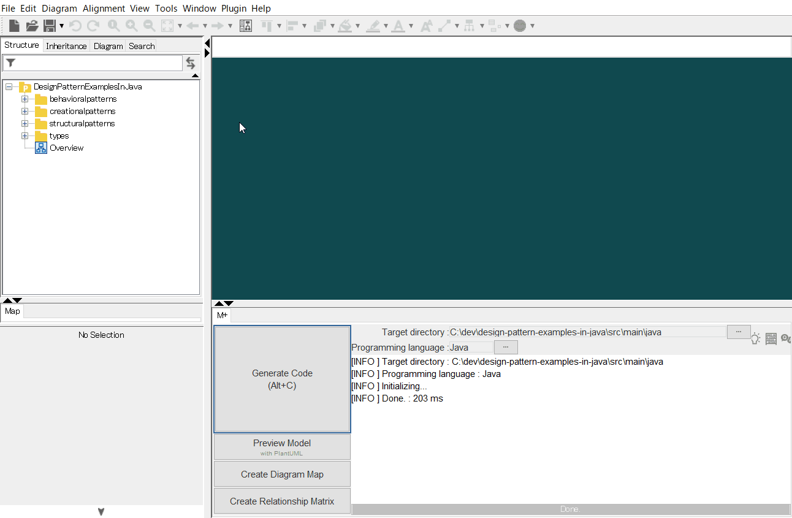

[](https://raw.githubusercontent.com/takaakit/design-pattern-examples-in-java/master/screenshots/DiagramMap.svg)

Design Pattern Examples in Java
===

Model and code examples of GoF Design Patterns for Java.  
This project is available for the following objectives:  

* To understand GoF Design Pattern examples in Java.
* To understand the mapping between UML model and Java code.
* To try Model-Driven Development (MDD) using Astah and M PLUS plug-in.

> UML model example:


<a id="code-example"></a>
> Java code example:

```java
package structuralpatterns.composite;
// ˅

// ˄

public class File extends FileSystemElement {
    // ˅
    
    // ˄

    private final String name;

    private final int size;

    public File(String name, int size) {
        // ˅
        this.name = name;
        this.size = size;
        // ˄
    }

    @Override
    public String getName() {
        // ˅
        return name;
        // ˄
    }

    @Override
    public int getSize() {
        // ˅
        return size;
        // ˄
    }

    // Print this element with the "upperPath".
    @Override
    public void print(String upperPath) {
        // ˅
        System.out.println(upperPath + "/" + this);
        // ˄
    }

    // ˅
    
    // ˄
}

// ˅

// ˄
```

Installation
------------
**UML Modeling Tool**
* Download the modeling tool [Astah](http://astah.net/download) UML or Professional, and install.  
* Download [M PLUS](https://sites.google.com/view/m-plus-plugin/download) plug-in **ver.2.4.0** or higher, and add it to Astah.  
  [How to add plugins to Astah](https://astahblog.com/2014/12/15/astah_plugins/)

**Java Development Environment**
* Install Java SDK **11** or higher.  
* Optionally, install an IDE (e.g. [IntelliJ](https://www.jetbrains.com/idea/download/)).

Usage
-----
**Code Generation from UML**
  1. Open the Astah file (model/DesignPatternExamplesInJava.asta).
  2. Select model elements on the model browser of Astah.
  3. Click the **Generate Code** button.  
    
  The generated code has **User Code Area**. The User Code Area is the area enclosed by "˅" and "˄". Handwritten code written in the User Code Area remains after a re-generation. [View code example](#code-example).  
  For detailed usage of the tools, please see [Astah Manual](http://astah.net/manual) and [M PLUS plug-in Tips](https://sites.google.com/view/m-plus-plugin-tips).

**Build and Run (if you use IntelliJ)**
  1. Open the project root directory (design-pattern-examples-in-java) in IntelliJ.
  2. Open `Main.java` for the pattern you want to run, and click `Run` icon in the left gutter.
       

References
----------
* Gamma, E. et al. Design Patterns: Elements of Reusable Object-Oriented Software, Addison-Wesley, 1994
* Hiroshi Yuki. Learning Design Patterns in Java [In Japanese Language], Softbank publishing, 2004

Licence
-------
This project is licensed under the Creative Commons Zero (CC0) license. The model and code are completely free to use.

[](http://creativecommons.org/publicdomain/zero/1.0/deed)

Other Language Examples
-----------------------
[C++](https://github.com/takaakit/design-pattern-examples-in-cpp), [C#](https://github.com/takaakit/design-pattern-examples-in-csharp), [Crystal](https://github.com/takaakit/design-pattern-examples-in-crystal), [Go](https://github.com/takaakit/design-pattern-examples-in-golang), [JavaScript](https://github.com/takaakit/design-pattern-examples-in-javascript), [Kotlin](https://github.com/takaakit/design-pattern-examples-in-kotlin), [Python](https://github.com/takaakit/design-pattern-examples-in-python), [Ruby](https://github.com/takaakit/design-pattern-examples-in-ruby), [Scala](https://github.com/takaakit/design-pattern-examples-in-scala), [Swift](https://github.com/takaakit/design-pattern-examples-in-swift), [TypeScript](https://github.com/takaakit/design-pattern-examples-in-typescript)
