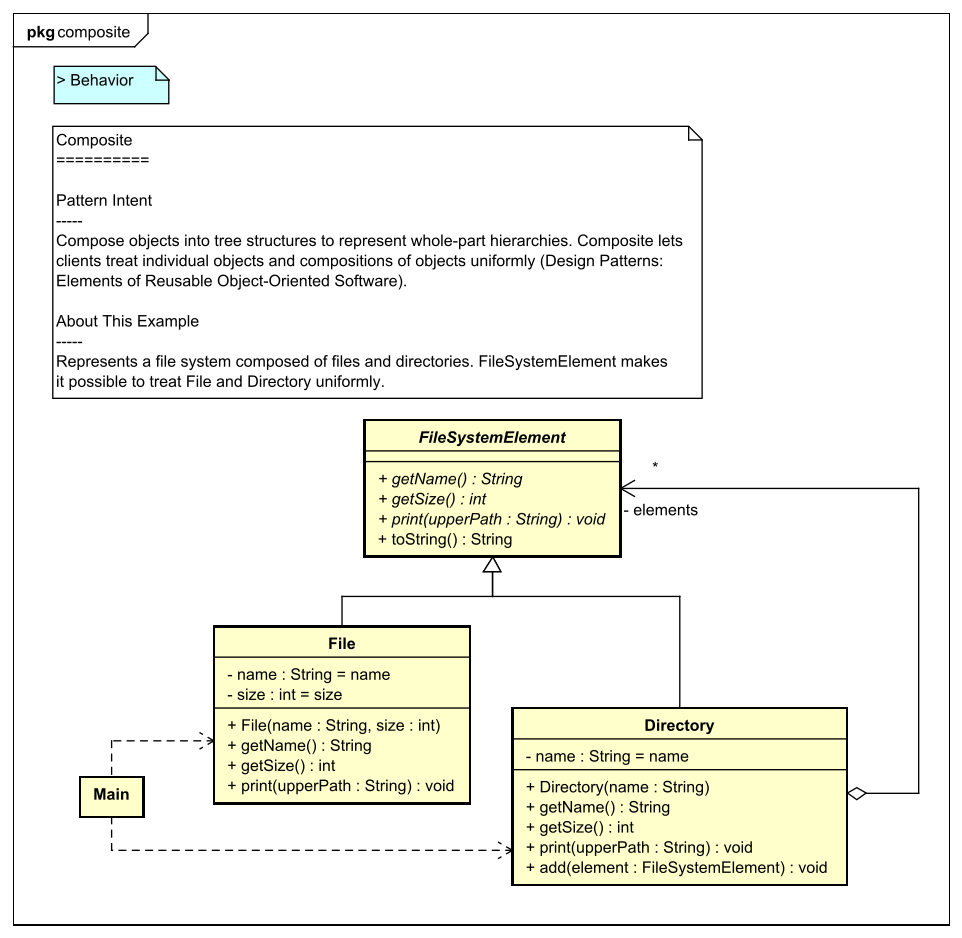

Design Pattern Examples in Java
===

Model and code examples of GoF Design Patterns for Java.  
This project is available for the following objectives:  

* To try Model-Driven Development (MDD) using Astah and M PLUS plug-in.
* To understand the mapping between UML model and Java code.
* To understand GoF Design Pattern examples in Java.  
  etc.

> UML model example:



> Java code example:

```java:File class
package structuralpatterns.composite;
// ˅

// ˄

public class File extends FileSystemElement {
    // ˅
    
    // ˄

    private final String name;

    private final int size;

    public File(String name, int size) {
        // ˅
        this.name = name;
        this.size = size;
        // ˄
    }

    @Override
    public String getName() {
        // ˅
        return name;
        // ˄
    }

    @Override
    public int getSize() {
        // ˅
        return size;
        // ˄
    }

    // Print this element with the "upperPath".
    @Override
    public void print(String upperPath) {
        // ˅
        System.out.println(upperPath + "/" + this);
        // ˄
    }

    // ˅
    
    // ˄
}

// ˅

// ˄
```

Installation
------------
**Astah**
* Download Astah UML or Professional from [Change Vision site](http://astah.net/download), and install.  

**M PLUS plug-in**
* Download the plug-in from [M PLUS plug-in site](https://sites.google.com/view/m-plus-plugin/download), and install.  
  Use **ver.2.4.0** or higher.

**Development Environment for Java and JavaFX**
* Prepare an arbitrary development environment for Java and JavaFX. If you don't want to install JavaFX, you need to remove the following packages that use JavaFX to prevent build errors.
  - src/main/java/behavioralPatterns/command
  - src/main/java/behavioralPatterns/mediator
  - src/main/java/behavioralPatterns/state

Usage
-----
1. Select model elements on the model browser of Astah.
2. Click the **Generate code** button.  
   The generated code has **User Code Area**. The User Code Area is the area enclosed by "˅" and "˄". Handwritten code written in the User Code Area remains after a re-generation.
3. Run the program from **Main.java** for each Design Pattern.  

For detailed usage of the tools, please see [Astah Manual](http://astah.net/manual) and [M PLUS plug-in Tips](https://sites.google.com/view/m-plus-plugin-tips).


References
----------
* Gamma, E. et al. Design Patterns: Elements of Reusable Object-Oriented Software, Addison-Wesley, 1994
* Hiroshi Yuki. Learning Design Patterns in Java [In Japanese Language], Softbank publishing, 2004

Licence
-------
This project is licensed under the Creative Commons Zero (CC0) license. The model and code are completely free to use.

[](http://creativecommons.org/publicdomain/zero/1.0/deed)
